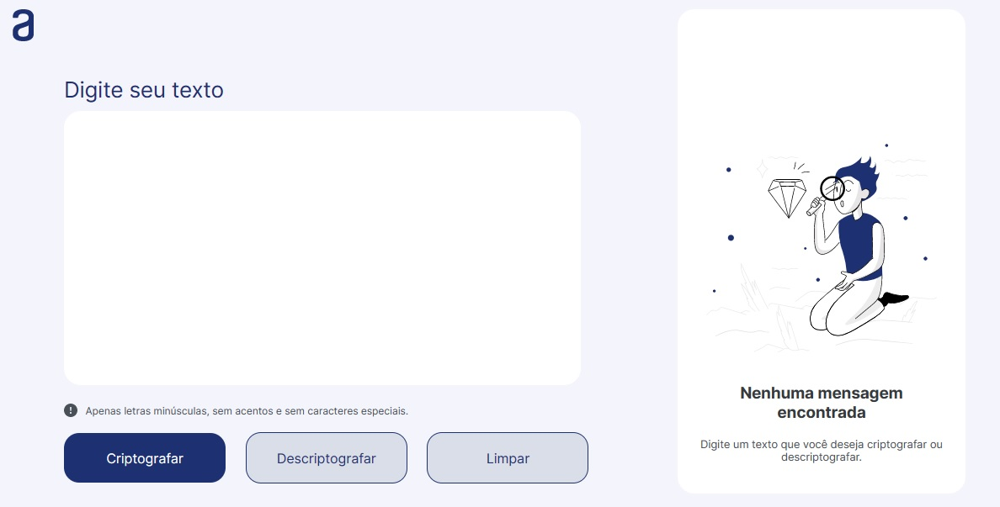

<h1 align="center"> DECODIFICADOR </h1>

Challenge proposto na primeira fase do Programa ONE (Alura + Oracle).

  <a href="#-tecnologias">Tecnologias</a>&nbsp;&nbsp;&nbsp;|&nbsp;&nbsp;&nbsp;
  <a href="#-projeto">Projeto</a>&nbsp;&nbsp;&nbsp;|&nbsp;&nbsp;&nbsp;
  <a href="#-layout">Layout</a>&nbsp;&nbsp;&nbsp;|&nbsp;&nbsp;&nbsp;
  <a href="#-badge">Badge</a>&nbsp;&nbsp;&nbsp;

 

  

## 🚀 Tecnologias

Esse projeto foi desenvolvido com as seguintes tecnologias:

- HTML e CSS
- JavaScript
- Git e Github

## 💻 Projeto

O Decodificador é um projeto feito com o objetivo de criptografar textos, permitindo que duas ou mais pessoas troquem mensagens secretas, desde que compartilhem da mesma aplicação.

## 🔖 Layout

Você pode visualizar o layout do projeto através [DESSE LINK](https://www.figma.com/file/tvFEYhVfZTjdJ5P24RGV21/Alura-Challenge---Desafio-1---L%C3%B3gica?node-id=0%3A1&t=DOtES3mec5qjCaXX-0). É necessário ter conta no [Figma](https://figma.com) para acessá-lo.

## 📝 Badge

Abaixo a Badge conquistada pela conclusão do Challenge.

  

